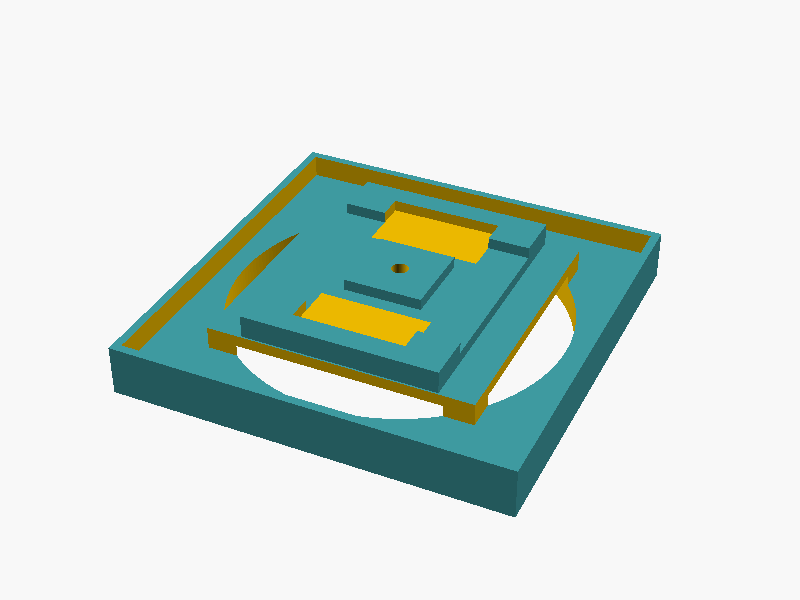
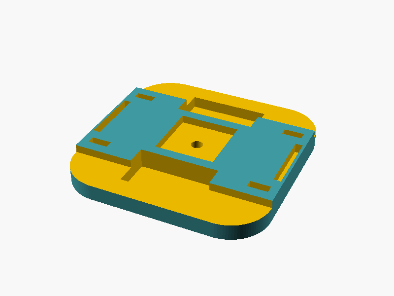

# Gira Tap Dial Connector

A 3D-printed connector adapter that allows you to mount a Philips Hue Tap Dial on a Gira F100 for seamless smart home integration.

## Overview

This project provides a mechanical adapter that bridges the gap between the popular Philips Hue Tap Dial smart controller and Gira's flush-mounted switch systems. The adapter consists of two main components:

- **Frontplate**: Provides the mounting interface and aesthetic integration
- **Backplate**: Ensures secure mechanical connection




## Components

### Products
- **[Philips Hue Tap Dial](https://www.philips-hue.com/en-us/p/hue-tap-dial-switch/046677578817)** - Smart wireless controller for Philips Hue lighting
- **[Gira F100](https://partner.gira.com/en/produkte/schalterprogramme/f100.html#cms-anchor-intro)** - Premium flush-mounted switch system
- You need an original Gira blind plate to attach the adapter

### 3D Printed Parts
- `frontplate_v1.scad` - Main mounting plate with connector interface
- `backplate_v1.scad` - Rear support structure
- `parts.scad` - Shared components and utilities

## Building

### Prerequisites
- OpenSCAD for rendering the 3D models
- 3D printer capable of printing PLA/PETG

### Rendering Images
To generate preview images of the components:

```bash
./render_images.sh
```

This will create PNG previews in the `images/` directory.

### 3D Printing
1. Open the SCAD files in OpenSCAD
2. Render to STL format (F6 then F7)
3. Print with standard settings:
   - Layer height: 0.2mm
   - Infill: 15%
   - Material: PLA or PETG
   - Supports: As needed for overhangs

## Installation

1. Print both the frontplate and backplate components
2. Remove the existing Gira switch cover
3. Install the adapter components
4. Mount the Hue Tap Dial using the provided mounting system
5. Configure the Hue Tap Dial in the Philips Hue app

## License

This project is open source. Please check local regulations regarding modifications to electrical installations.
